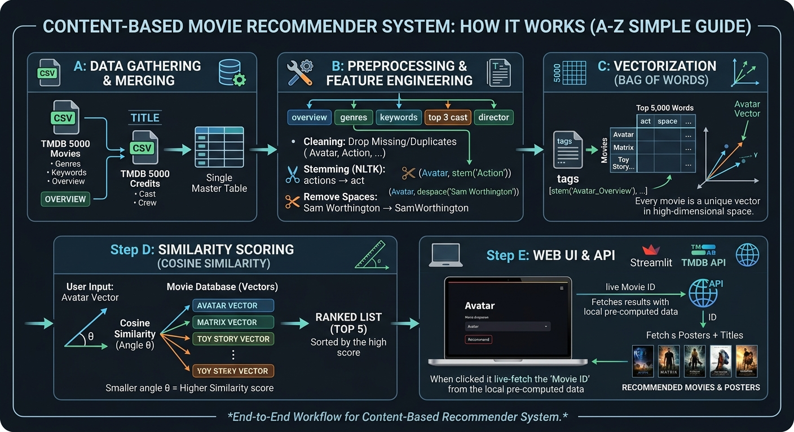

A content based movie recommender system using cosine similarity
# Movie Recommender System 🎬

An end-to-end Machine Learning web application that predicts and recommends five similar movies based on a user's choice. The system utilizes advanced Natural Language Processing (NLP) techniques to analyze movie metadata and leverages a live API to fetch real-time movie posters.

---

## 🔥 How It Works

The system operates on an architecture split into data preprocessing, vector spaces, and front-end rendering:

### 1. Data Merging & Feature Selection
The application processes raw data from the TMDB 5000 dataset, linking structural movie features with their corresponding crew and cast configurations using the movie title as a primary identifier. 

To keep the system highly relevant, it drops non-contextual numeric values (like budget or revenue) and extracts key structural text components: **Movie ID, Title, Overview, Genres, Keywords, Top 3 Cast Members, and the Director**.

### 2. The Text Processing Pipeline
To convert raw descriptive strings into machine-understandable tokens, the text is pushed through a custom NLP pipeline:
* **Token de-spacing:** Spaces inside multi-word entities are stripped (e.g., `Sam Worthington` becomes `SamWorthington` and `Science Fiction` becomes `ScienceFiction`). This stops the algorithm from confusing distinct entities that share common sub-names.
* **Text Concatenation:** All descriptive features are merged into a unified metadata string column called `tags`.
* **Stemming:** Using the NLTK library's `PorterStemmer`, words are chopped down to their base root form (e.g., `activities`, `actions`, and `acting` all resolve back to `act`) to remove semantic noise.

### 3. Vector Space Transformation & Similarity Scoring
Computers cannot directly compare words mathematically, so the system shifts the problem from text matching to spatial geometry.

* **Bag of Words (Vectorization):** A `CountVectorizer` model scans the entire database to extract the top **5,000 most frequent unique words** (excluding generic English stop words like 'and', 'the', 'is'). It then calculates the word count frequencies for every individual film, mapping each movie as a distinct coordinate point (vector) in a **5,000-dimensional coordinate grid**.
* **Cosine Similarity:** Instead of measuring the physical distance between coordinates (which breaks down in high dimensions), the algorithm computes the **Cosine Similarity**—measuring the angle ($\theta$) between movie vectors. A smaller angle signifies that two movies share heavily identical content patterns.

---

## 🛠️ Machine Learning Techniques Used

* **Content-Based Filtering:** Recommends items by finding similarities between metadata profiles of the objects themselves, rather than relying on collaborative user rating history.
* **Text Vectorization (Bag of Words):** Converts text documents into an absolute matrix of token frequencies.
* **Stemming (NLTK):** Normalizes words by stripping affixes to isolate their semantic core.
* **Cosine Similarity ($\cos\theta$):** Calculates the directional similarity metric between non-zero vectors in a multi-dimensional space, bounded strictly between 0 and 1.

---

## 💻 Tech Stack & Architecture

* **Core Language:** Python
* **Machine Learning & NLP:** Scikit-Learn, NLTK, Pandas, NumPy
* **Web UI Framework:** Streamlit
* **Live Media Rendering:** The Movie Database (TMDB) REST API (Fetches live high-resolution imagery using structural unique IMDB/TMDB system IDs)
